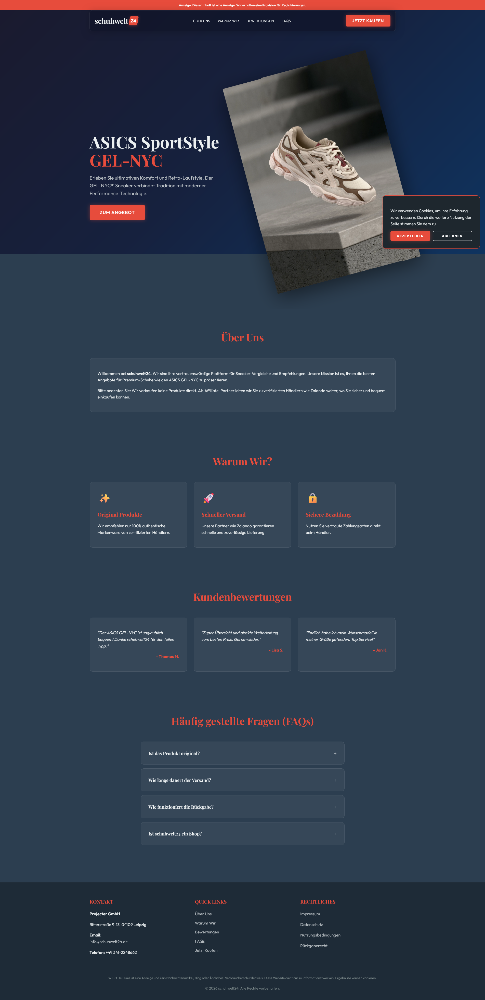

# schuhwelt24 - Premium Sneaker Deals

schuhwelt24 is a premium sneaker comparison platform designed for enthusiasts seeking curated collections and the best market deals. The interface features a minimalist and modern design, optimized for a high-end shopping experience.

---

## 📸 Site Preview

---

## 🛠️ Tech Stack
- **HTML5**: Leveraged for clean, semantic structure.
- **Vanilla CSS**: Custom-built styling featuring glassmorphism effects and smooth transitions.
- **JavaScript**: Efficiently manages UI interactions, preloader sequences, and responsive animations.

## 🌟 Key Features
- **Modern Glassmorphism UI**: A sleek, contemporary aesthetic.
- **Interactive Components**: Dynamic FAQ sections and immersive product modals.
- **Strategic Integration**: Seamless affiliate marketing pathways (Zalando & others).
- **Fully Responsive**: Optimized for flawless performance across all mobile and desktop devices.

---

## 👨‍💻 Developed By
**Muzaffar**
*Lead Developer at iInfynite*

Developed according to professional agency standards to ensure high performance and scalability.

---

**Built with ❤️ for iInfynite**
